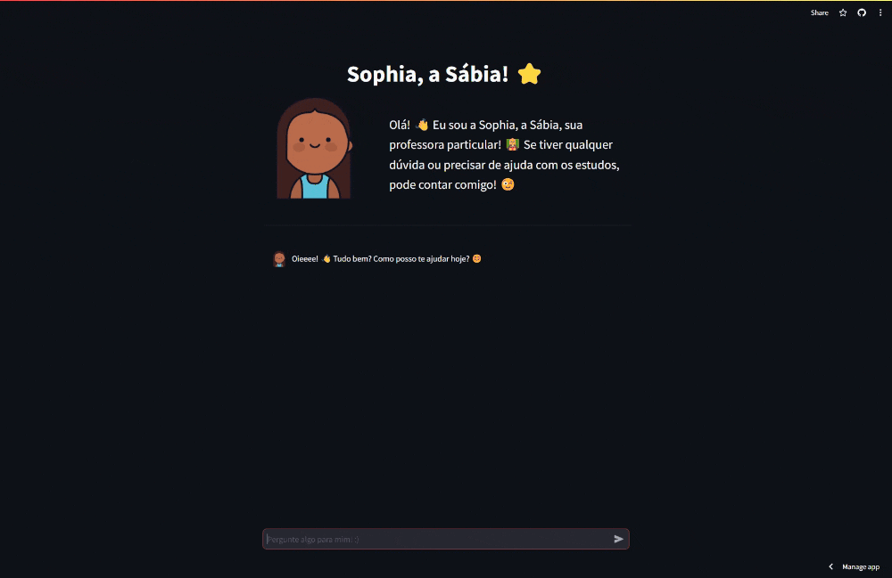
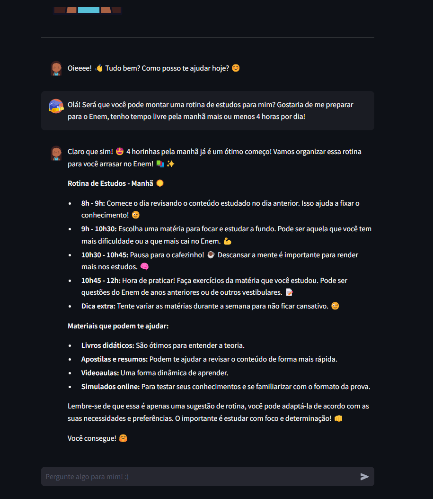

<br>

<h1 style="text-align: center">Sophia, a Sábia ⭐</h1>

<br>


<br>

## 💭 Quem é você?

<div style="display: flex; align-items: center">
  
    <div style="display: flex; flex-direction: column; align-items: center">
        <p>Oiee!!👋🏽 Eu me chamo Sophia. 🤓 Sou apaixonada por educação e adoro ajudar meus alunos a descobrirem o mundo do conhecimento! 🌎📚</p>
        <p>O que mais posso te contar? Ah, eu sou especialista em diversas áreas, como história, matemática, ciências e muito mais! 🤯 E o melhor de tudo: estou sempre disposta a aprender coisas novas e compartilhar o que sei com você! 🤩</p>
    </div>
</div>

<br>

## 💭 Como vc pode me ajudar?

Uau, 🤩 existem inúmeras maneiras de te ajudar!

Para começar, posso te auxiliar com:

- Esclarecimento de dúvidas: Seja em qual matéria for, pode me perguntar! 📚
- Explicação de conceitos: Do básico ao avançado, estou aqui para te ajudar a entender tudo direitinho. 🧠
- Sugestão de materiais de estudo: Livros, sites, vídeos... tenho uma lista enorme para compartilhar! 📝
- Preparação para provas e trabalhos: Vamos arrasar nessas avaliações! 💪
- Desenvolvimento de habilidades de estudo: Organização, foco, técnicas de memorização... tudo para você aprender melhor! 🤓
- Descoberta de novas áreas do conhecimento: Vamos explorar juntos o mundo fascinante do saber! 🌎

E aí, por onde começamos? 😉

<div>
    
     
</div>

## 💭 Ok, mas por onde eu começo?

É super fácil! É só seguir esses passos:

1. **Acesse meu site:** É só clicar aqui 👉 https://asksophia.streamlit.app/ e você já estará no lugar certo!

2. **Faça sua pergunta:** Pode perguntar qualquer coisa relacionada à educação, pode ter certeza que eu vou saber te responder! 😉

3. **Receba a resposta:** Vou ler sua pergunta com bastante atenção e te dar uma resposta personalizada, explicando tudo direitinho! 🤓

4. **Continue a conversa:** Se tiver mais dúvidas ou quiser saber mais sobre o assunto, é só continuar perguntando! Tô sempre aqui pra te ajudar! 😊

Viu como é fácil? Agora sempre que precisar pode me perguntar! 📚📝

<div>
    
     
</div>

## 💭 Qualquer um pode usar?

Simm!! Seja você um estudante, professor, pai, ou simplesmente alguém curioso, pode contar comigo! 🦉

A educação é para todos, e eu quero tornar o aprendizado algo acessível e prazeroso! 🌎📚 Então não importa sua idade ou nível de conhecimento, pode chegar junto e vamos aprender juntos! 🤝

## 💭 Como faço para rodar o projeto localmente?

<p align='justify'>Você também pode rodar a Sophia localmente! Basta seguir os seguintes passos abaixo! Divirta-se! 😉</p>

Clone o projeto (c/ SSH)

```bash
  git clone git@github.com:kaledbarreto/SophIA.git
```

Vá para o diretório do projeto

```bash
  cd SophIA
```

Instale as dependências do projeto

```bash
  pip install -r requirements.txt
```

Crie um arquivo chamado `.env` com o seguinte conteúdo:

```.env
GOOGLE_API_KEY = "<YOUR-GOOGLE-API-KEY>"
```

Inicie o servidor

```bash
  python streamlit run src/app.py
```

## Autor

  <div style="text-align: center; padding: 20px;">
    
    <p style="font-size: 24px; font-weight: bold; color: #fff;">Kaled Barreto</p>
    <a href="https://www.linkedin.com/in/kaledbarreto/" target="_blank" style="margin-top: 10px; display: inline-block; padding: 5px 10px; background-color: #0077B5; color: white; text-decoration: none;">LinkedIn</a>
  </div>
<br>
