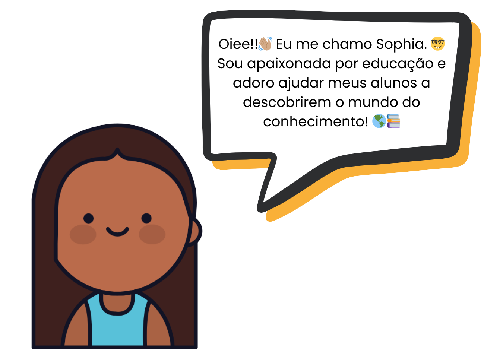
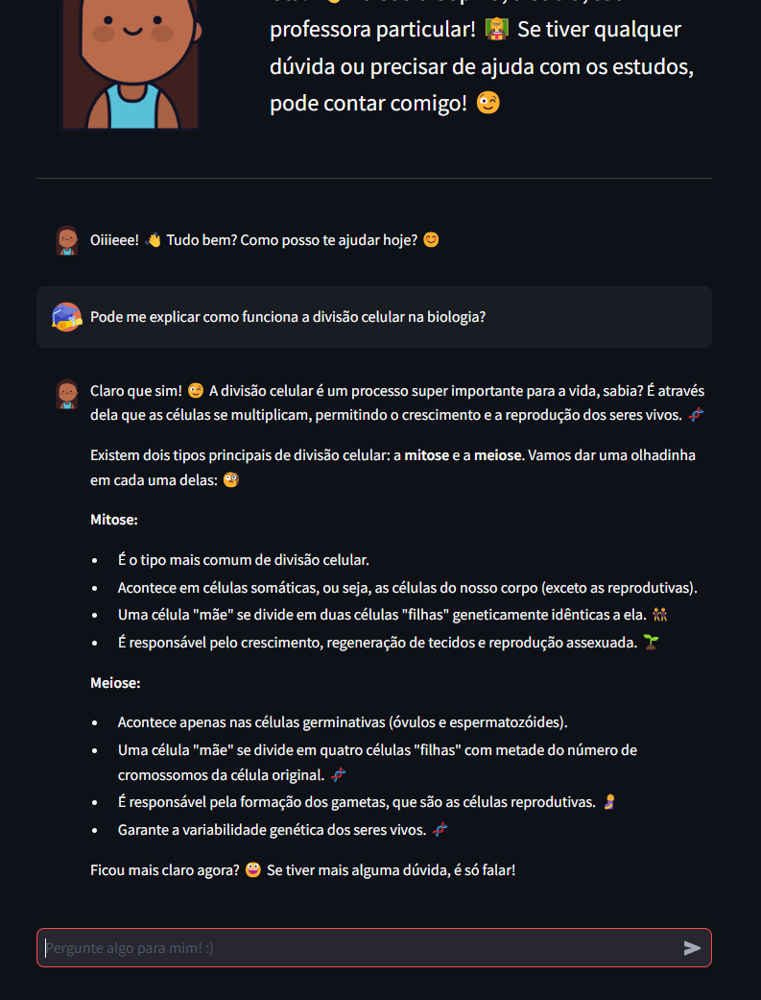
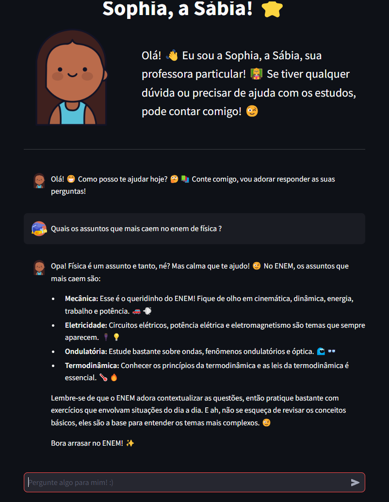
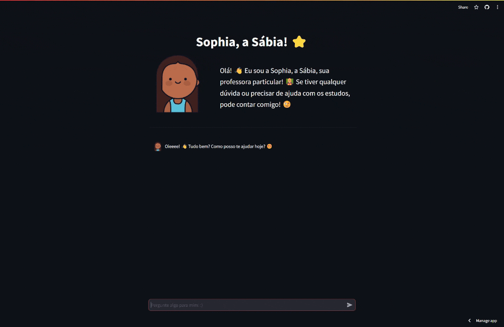

<br>


<br>

## 💭 Quem é você?


<div style="display: flex; flex-direction: column; align-items: center">
  <p>O que mais posso te contar? Ah, eu sou especialista em diversas áreas, como história, matemática, ciências e muito mais! 🤯 E o melhor de tudo: estou sempre disposta a aprender coisas novas e compartilhar o que sei com você! 🤩</p>
  <p> A educação é para todos, e eu quero tornar o aprendizado algo acessível e prazeroso! 🌎📚 Então não importa sua idade ou nível de conhecimento, pode chegar junto e vamos aprender juntos! 🤝
  </p>
</div>

<br>

## 🔍 Sumário

- 💭 [Como vc pode me ajudar?](#how)
- 💭 [Ok, mas por onde eu começo?](#where-start)
- 💭 [Como faço para rodar o projeto localmente?](#how-to-run)
- 💭 [Quais são os próximos passos?](#next-steps) 👀
- ⭐ [Autor](#author) ⭐

<br>

<a id="how"></a>

## 💭 Como vc pode me ajudar?

Uau, 🤩 existem inúmeras maneiras de te ajudar!!

Para começar, posso te auxiliar com:

- Esclarecimento de dúvidas: Seja em qual matéria for, pode me perguntar! 📚
- Explicação de conceitos: Do básico ao avançado, estou aqui para te ajudar a entender tudo direitinho. 🧠
- Sugestão de materiais de estudo: Livros, sites, vídeos... tenho uma lista enorme para compartilhar! 📝
- Preparação para provas e trabalhos: Vamos arrasar nessas avaliações! 💪
- Desenvolvimento de habilidades de estudo: Organização, foco, técnicas de memorização... tudo para você aprender melhor! 🤓
- Descoberta de novas áreas do conhecimento: Vamos explorar juntos o mundo fascinante do saber! 🌎

E aí, por onde começamos? 😉

|                                               |                                               |
| :-------------------------------------------: | :-------------------------------------------- |
|  |  |

<br>

<a id="where-start"></a>

## 💭 Ok, mas por onde eu começo?

É super fácil! É só seguir esses passos:

1. **Acesse meu site:** É só clicar aqui 👉 https://asksophia.streamlit.app/ e você já estará no lugar certo!

2. **Faça sua pergunta:** Pode perguntar qualquer coisa relacionada à educação, pode ter certeza que eu vou saber te responder! 😉

3. **Receba a resposta:** Vou ler sua pergunta com bastante atenção e te dar uma resposta personalizada, explicando tudo direitinho! 🤓

4. **Continue a conversa:** Se tiver mais dúvidas ou quiser saber mais sobre o assunto, é só continuar perguntando! Tô sempre aqui pra te ajudar! 😊

Viu como é fácil? Agora sempre que precisar pode me perguntar! 📚📝

<br>



<br>

<a id="how-to-run"></a>

## 💭 Como faço para rodar o projeto localmente?

<p align='justify'>Você também pode rodar a Sophia localmente! Basta seguir os seguintes passos abaixo! Divirta-se! 😉</p>

Clone o projeto (c/ SSH)

```bash
$ git clone git@github.com:kaledbarreto/SophIA.git
```

Vá para o diretório do projeto

```bash
$ cd SophIA
```

Instale as dependências do projeto

```bash
$ pip install -r requirements.txt
```

Crie um arquivo chamado `.env` com o seguinte conteúdo como no `.env.example`

```.env
GOOGLE_API_KEY = "<YOUR-GOOGLE-API-KEY>"
```

Inicie o servidor

```bash
$ streamlit run src/app.py
```

<br>

<a id="next-steps"></a>

## 💭 Quais são os próximos passos? 👀

- [ ] Integração de Reconhecimento de Voz e Comando

  - A ideia é permitir que os usuários interajam por voz, transmitindo comandos e informações. Imagine só, pedir para a Sophia responder algo, só falando! 🎙️ Incrível, né?

<br>

- [ ] Upload de Imagens para Perguntas Mais Completas

  - Dar aos usuários a possibilidade de enviar imagens para complementar suas perguntas. Se uma imagem vale mais que mil palavras, imagina o poder de uma pergunta com imagem! 🖼️ A Sophia vai entender tudo rapidinho e mandar respostas ainda mais incríveis! 🚀

<br>

- [ ] Integração com o Google para um Atendimento Super Personalizado

  - Imagine a Sophia conectada com o seu Google Agenda! 🗓️ Ela poderia te lembrar de tarefas importantes, compromissos e até datas de entrega de trabalhos! 🤯 Seria como ter uma assistente pessoal te auxiliando nos estudos! 📚 Incrível, né?

<br>

<a id="author"></a>

## ⭐ Autor ⭐

- Meu nome é **Kaled Barreto**, tenho 22 anos e sou um desenvolvedor Front-end com mais de 5 anos de experiência em desenvolvimento web! Sou formado em Análise e Desenvolvimento de Sistemas no SENAI Cimatec e atualmente estou no ultimo semestre cursando Ciências da Computação na UNIFACS.

<br>

- **Redes Sociais:**
  - Github: [**@kaledbarreto**](https://www.github.com/kaledbarreto)
  - Linkedin: [**Kaled Barreto**](https://www.linkedin.com/in/kaledbarreto/)
